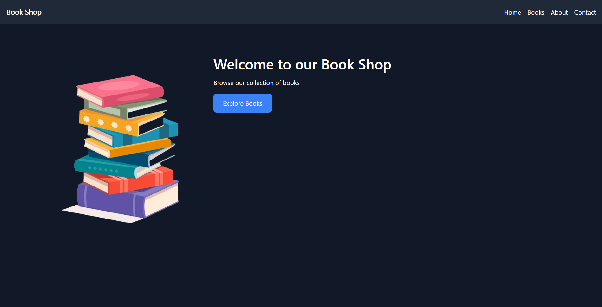
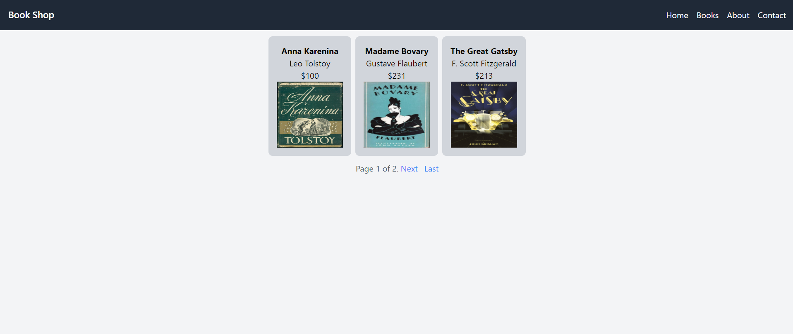
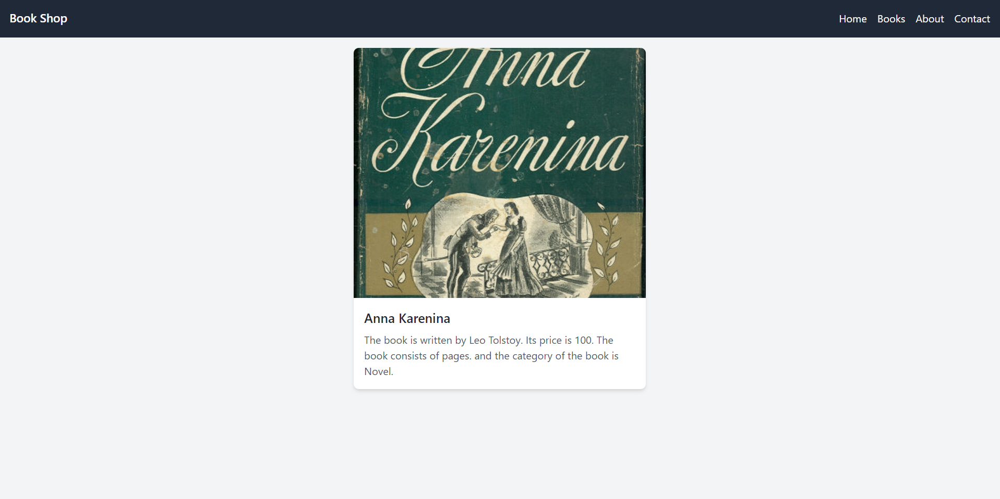

# Book Shop Django Application
This is a simple Django application that allows users to view 
the list of books available in the store. Users can also view
a detailed description of each book in the JSON format.

## Installation
- Clone the repository
- Install the required packages using the following command:
```bash
pip install -r requirements.txt
```
- Apply the migrations using the following command:
```bash
  python manage.py migrate
```

- Run the server using the following command:
```bash
python manage.py runserver
```

# Detailed Description
The application uses one model to store the books' information.
```python

from django.db import models
from django.utils.translation import gettext as _

class Book(models.Model):
    name = models.CharField(max_length=100, verbose_name=_('name'))
    page_count = models.IntegerField(verbose_name=_('page count'))
    category = models.CharField(max_length=100, verbose_name=_('category'))
    author_name = models.CharField(max_length=100, verbose_name=_('author name'))
    price = models.IntegerField(verbose_name='Price')
    image = models.ImageField(upload_to='images/', null=True, blank=True, verbose_name=_('image'))
    
    def __str__(self):
        return self.name
        
        class Meta:
        verbose_name = _('book')
        verbose_name_plural = _('books')
        ordering = ['name', 'price', 'page_count', 'author_name']
        indexes = [
            models.Index(fields=['name'], name='name_idx'),
            models.Index(fields=['price'], name='price_idx'),
            models.Index(fields=['page_count'], name='page_count_idx'),
            models.Index(fields=['author_name'], name='author_name_idx')
        ]
        constraints = [
            models.UniqueConstraint(fields=['name', 'author_name'], name='unique_book')
        ]
```

Here is a brief description of the fields:
- `name` - The name of the book
- `page_count` - The number of pages in the book
- `category` - The category of the book
- `author_name` - The name of the author of the book
- `price` - The price of the book
- `image` - The image of the book
- `__str__` - The string representation of the book object
- `Meta` - The metadata of the model
    - `verbose_name` - The verbose name of the model
    - `verbose_name_plural` - The verbose name of the model in plural form
    - `ordering` - The default ordering of the model
    - `indexes` - The indexes of the model
    - `constraints` - The constraints of the model


## Usage
The application can be accessed at the following URL:
- `/` - View the home page'


- `books/` - View the list of books available in the store



- `books/<int:book_id>/` - View the detailed description of a book



At this point, the creation of the books is done manually through the Django admin panel.
where you can create, update, and delete books.

Also, you can search for books by name and author using the search bar.

